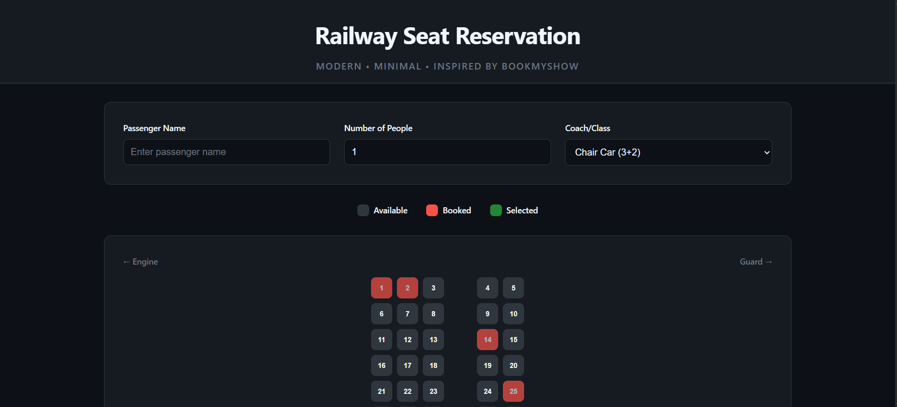
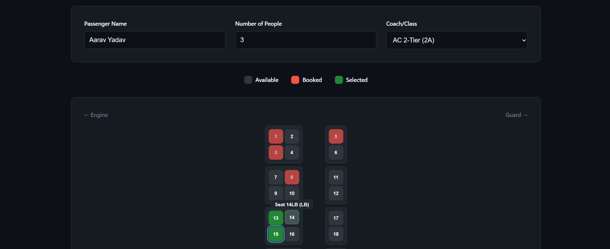
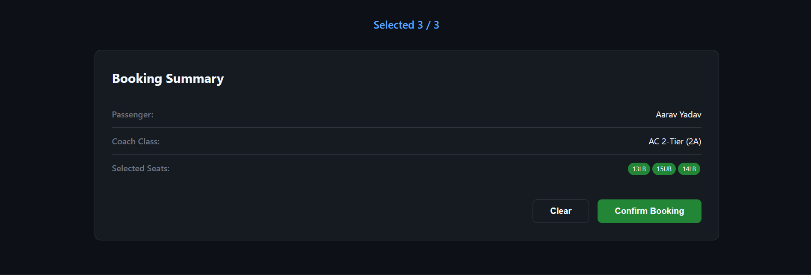
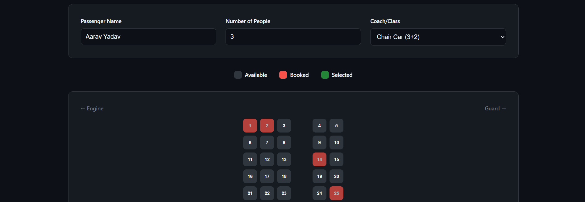
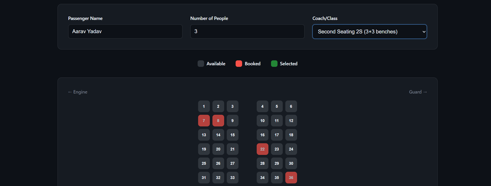
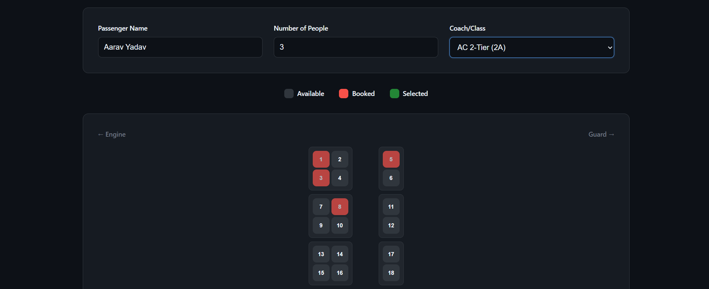
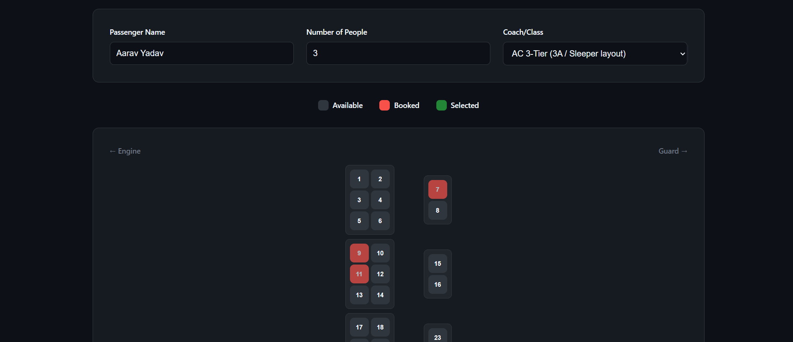

# Railway Reservation System (Array-based)

A simple **Railway Seat Reservation System** built using **HTML, CSS, and JavaScript**, inspired by real-world railway booking layouts.  
This project uses a **2D array representation of seats** to support booking, cancellation, and seat availability checks.  

---

## Project Structure
``` bash
index.html → Main UI structure
style.css → Styling for the booking system
script.js → Core logic for seat booking & availability
```

## Features

- **Book / Cancel Tickets**  
- **Visual Seat Layout** (different coach/class options)  
- **Real-time Selection Counter**  
- **Booking Summary Panel**  
- **Pre-booked seat simulation**  
- **Responsive Design**  

## How to Run

1. Clone or download this repository.  
2. Open `index.html` in your browser.  
3. Select passenger details, number of seats, and coach type.  
4. Click seats to book or cancel, then confirm your reservation.  

## Recommended Screenshots to Include

1. **Homepage UI** → Showing the initial seat map and booking form.  

2. **Seat Selection** → After selecting multiple seats.  

3. **Booking Summary Panel** → Showing passenger name, coach type, and selected seats.  

4. **Different Coach Layouts** → At least one screenshot each for:  
   - Chair Car (3+2)  
   
   - Second Seating 2S (3+3 benches)  
   
   - AC 2-Tier (2A) 
    
   - AC 3-Tier (3A)  
   

## Technologies Used

- **HTML5** → Structure  
- **CSS3** → Styling & Layout  
- **JavaScript (ES6)** → Seat logic and booking flow  


## 👨‍💻 Author

Developed as part of a **Railway Reservation System (Array-based)** project.  
BY: Abhishek Karthik, Mahi Shukla